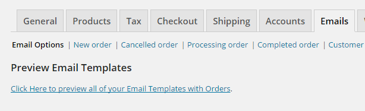
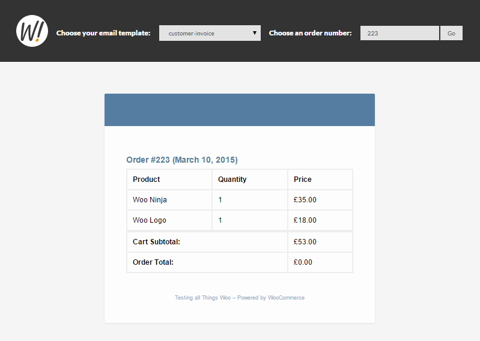

# WooCommerce Preview Emails
The easiest way to preview your WooCommerce emails as a reference while you customize them in your theme.

[See full write-up about Customizing and Previewing WooCommerce Emails here](https://wordimpress.com/customize-and-preview-woocommerce-emails/)

**The Problem**

WooCommerce enables you to customize your emails very easily, except for one important detail: You can't preview the email without triggering it to be sent to your email address.

**The Solution**

This snippet does two things for you:

1. It helps get you started toward customizing your emails yourself.
2. It adds a Preview Email Template link to your WooCommerce Email Settings tab. 

**Requirements**

* WordPress self-hosted installation
* WooCommerce 2.3 or higher
* FTP/SSH access or localhost environment
* Code editor of your choice

# STEP 1: Clone Repo and Copy "emails" folder to your theme
Clone or download and extract this repository into your theme's `my-theme/woocommerce` directory. The end result should look like this:

* your-theme (folder)
 - woocommerce (folder)
     * emails (folder)
         - woo-preview-emails.php (file)
         - email-header.php (file)
         - email-footer.php (file)
         -  img (folder)
             * wordimpress-icon.png (file)
             
# STEP 2: Require the file in your functions.php
Now you need to require the `woo-preview-emails.php` file in your themes `function.php` file. Here is an example:

```
/**
* Preview WooCommerce Emails.
* @author WordImpress.com
* @url https://github.com/WordImpress/woocommerce-preview-emails
* If you are using a child-theme, then use get_stylesheet_directory() instead
*/

$preview = get_stylesheet_directory() . '/woocommerce/emails/woo-preview-emails.php';

if(file_exists($preview)) {
    require $preview;
}
```

**NOTE:** If your theme or child theme puts functions in a sub-folder, you'll need to update that path to point to the `woocommerce/emails` folder, it just has to be a relative path. For 90% of all WordPress themes if you just put that in your root functions.php file in your theme you'll be gold.

# STEP 3: Enjoy!
You can now see the your previews by going to your WordPress Dashboard, and navigate to "WooCommerce > Settings" and click on the "Emails" tab. At the top of the very first sub-tab, called "Email Options", you should see a new section called "Preview Email Templates". 



You now also can copy over any of the WooCommerce email templates into this `emails` folder and you'll be able to customize them there directly. [You can read about that here](http://docs.woothemes.com/document/template-structure/ "WooCommerce Template Override Documentation").

After you click on the link you'll be able to see your email templates. 


You'll also notice the select options which allow you to dynamically select which template you'll be previewing. Some templates are populated with order information. When you select a template that has order information, a "order" field will appear so you can see the live data populated in the template.

# FAQ
1. **Why did you include the email-header.php and email-footer.php files?**  
I did a couple things with them to make sure the template chooser and styles loaded correctly. But that custom JS and PHP is not ported to the actual emails that get sent to your customers, they are loaded conditionally only when viewing in the preview mode.  
The other thing I did was change the table widths so that the template is responsive. Feel free to edit that however you like, but I can't imagine why you'd NOT want responsive emails ;-)
2. **Where do I get the files to edit other email templates**  
In WooCommerce 2.3+, the principle is exactly the same as any other customizeable template. WooCommerce keeps them in the `templates\emails` folder. Copy them into the `woocommerce\emails` and edit to your hearts content.
3. **Can you help me customize my email templates**  
Sorry, this is made publicly and freely available to help developers build awesome websites for their clients. Naturally though, if there's a problem with the actual functionality of this drop-in code let us know and we'll work it out.
4. **I took your code and extended it to do even more. Can I do a pull request?**  
Sure! We'd love to see how this code helps others do even more cool stuff.


# ABOUT WORDIMPRESS


We build impressive Plugins and Themes for your WordPress website. Find out more about us and read more great tutorials at https://wordimpress.com 
